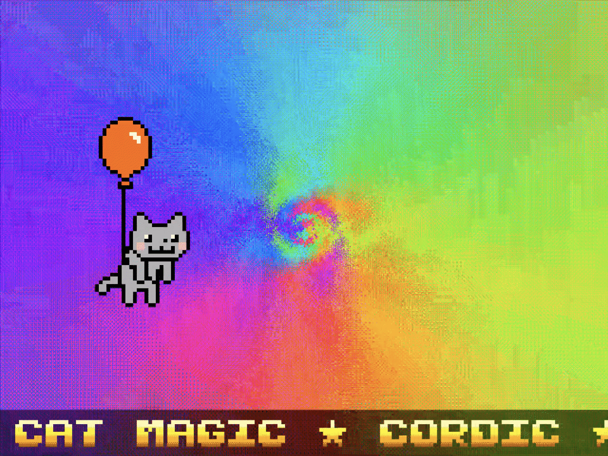

## How it works

**Journey** is an intro in just 2 tiles: dark tunnels and a cat on a
red balloon casting spells, bringing colors and joy, with chiptune
music and a scrolling text overlay.

## How to test

Connect the Tiny VGA Pmod to the output and the TT Audio Pmod to the
bidir pins. Apply a 25 MHz clock, pulse reset, and the demo starts
automatically — VGA 640×480 @ 60 Hz on the display, 1-bit sigma-delta
audio on `uio[7]`.

## External hardware

- [Tiny VGA Pmod](https://github.com/mole99/tiny-vga)
- [TT Audio Pmod](https://github.com/MichaelBell/tt-audio-pmod)
