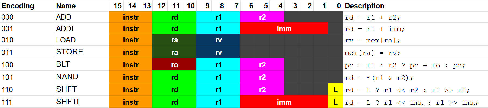

<!---

This file is used to generate your project datasheet. Please fill in the information below and delete any unused
sections.

You can also include images in this folder and reference them in the markdown. Each image must be less than
512 kb in size, and the combined size of all images must be less than 1 MB.
-->

## Overview

`chip-w26` is a very simple 8-bit processor that also (technically) outputs to VGA. It has four internal general-purpose 8-bit registers and a custom ISA with eight 16-bit instructions. `chip-w26` has support for up to 1024 16-bit instructions in flash memory and 256 bytes of RAM for data.

Due to constraints with using SPI for memory, `chip-w26` executes a non-store/load instruction in roughly 100 clock cycles and a store/load instruction in roughly 200 clock cycles. **This will almost certainly interfere with intricate VGA work**, as this means between every instruction, the beam will have traced at least another 100 pixels. See more information below.

### Instruction Encodings



Note: For **ADD**, **ADDI**, **BLT**, values in input registers (`r1`, `r2`, and `ro`) and the immediates (`imm`) are treated as signed numbers using two's complement. This means that the immediate in **ADDI** can at most range from [-32, 31].

Note: If try to branch to a negative program counter address, is undefined behavior. i.e. `BLT (-6) (0) (1)` as the 0th instruction (where program counter would be 0).

Note: Technically can branch to an unaligned address. Highly discouraged.

### Memory

`chip-w26`, for simplicity, uses the flash memory exclusively for instructions and RAM exclusively for data. Therefore, the address stored in the program counter, which increments by 2 after each instruction, is different from the addresses that the processors **LOAD**s from and **STORE**s into.

The program counter is 11 bits wide, allowing access to up to 2048 bytes. However, since every instruction is 16 bits, each instruction takes up two bytes. Thus, after normally executing an instruction (and not branching), the program counter automatically increments by 2.

Instructions are assumed to be stored in a big-endian style.
```
                 5432109876543210
1st instruction: abcdefghijklmnop
2nd instruction: qrstuvwxyzabcdef
memory:
addr | data
-----------
 0   | abcdefgh
 1   | ijklmnop
 2   | qrstuvwx
 3   | yzabcdef
```

The first instruction fetched will always be at address 0 in flash memory.

RAM accesses, through **LOAD** and **STORE** can address up to a value stored in one of the registers. In other words, only addresses representable in 8 bits are available. This means there are 256 bytes of read/write RAM available.

### VGA

??

## How to test

Pull `rst_n` low, then flash desired program within the first 2048 bytes. Once let `rst_n` go high and start clocking, processor will begin fetching from address 0 and program (should) start running!

Note that programs should end with an infinite loop or expect to restart once the program counter overflows.

## External hardware

Referring to the 3 PMOD headers on the [default TT demo board](https://tinytapeout.com/specs/pcb/):

**INPUT**: None.

**BIDIR**: [QSPI PMOD](https://github.com/mole99/qspi-pmod/tree/main) for flash and RAM.

**OUTPUT**: [TinyVGA PMOD](https://github.com/mole99/tiny-vga) to drive a VGA screen.
