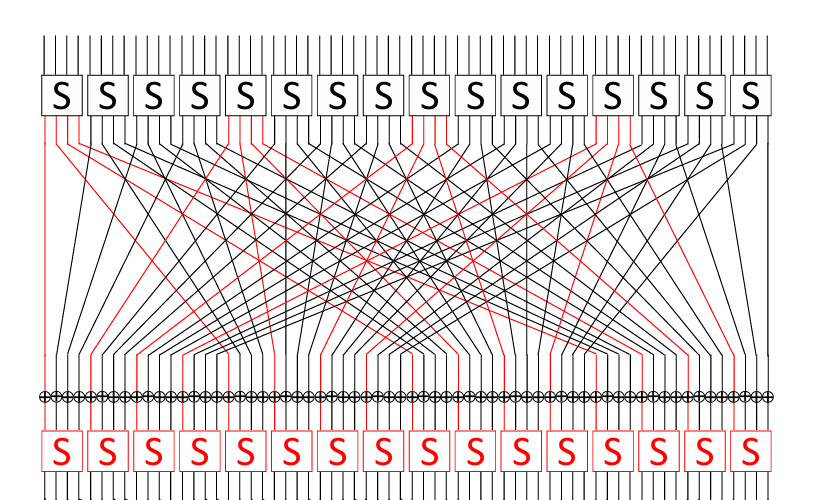

<!---

This file is used to generate your project datasheet. Please fill in the information below and delete any unused
sections.

You can also include images in this folder and reference them in the markdown. Each image must be less than
512 kb in size, and the combined size of all images must be less than 1 MB.
-->

## PRESENT-80 Cipher with Hardware-Trojan

This project is an implementation of the PRESENT symmetric cipher using a 80-bits encryption key, with a proof-of-concept hardware trojan (as explained [here](https://arxiv.org/pdf/1702.08208)).
The trojan allows for inserting distinct glitches on selected nibbles of the output of the S-box at the 30th round, which in turn allow an attacker to recover or brute-force the last round-key.

## How it works

### Regular operation

After a reset, three different commands can be issued to the module, using pins `uio_in[1:0]`:

- KEY_IN = 1: read byte from `ui_in` and append it to the inner key register
- DATA_IN = 2: read byte from `ui_in` and append it to the inner data register 
- LOAD = 3: load key and data registers into the crypto module, and start encryption round

When the "data_out_valid" signal (pin `uio_out[2]`) goes high, the ciphertext can be read by saving the 8 bytes loaded into `uo_out[7:0]` in the following 8 clock cycles.

### Triggering the Hardware-Trojan 

The theory behind the "fault injection" attck is explained in the paper [Multiple Fault Attack on PRESENT with a Hardware Trojan Implementation in FPGA](https://arxiv.org/pdf/1702.08208), and it is recommended to be familiar with its content in order to understand the attack.
The hardware-trojan gets triggered when the same non-all-zeros plaintext is loaded for encryption.
The trojan is triggered even if the key changes, but in this case the faulty results will contribute in bruteforcing the key(s).

Each time the same plaintext is loaded for encryption, an internal "trigger" register is increased, from 0 to 4.
Each non-sero value of such register inserts a fault that flips the bits of the output of specific S-boxes at the 30th round, according to a "fault mask". 

|Trigger|Flipped Bits|Mask|
|-------|------------|----|
|0|0000_0000_0000_0000| 0000 (No glitch) | 
|1|f000_f000_f000_f000| 1000 | 
|2|0f00_0f00_0f00_0f00| 0100 | 
|3|00f0_00f0_00f0_00f0| 0010 | 
|4|000f_000f_000f_000f| 0001 | 

The mask indicates how the fault propagates to the input bits of each of the S-boxes in the 31st round of encryption. The following figure shows the propagation for the mask 1000.

<figure>
    
    <figcaption>Fault propagation for mask 1000, https://arxiv.org/pdf/1702.08208.</figcaption>
</figure>

## How to test

Functional tests for the chiper (taken from [here](https://opencores.org/websvn/filedetails?repname=present&path=%2Fpresent%2Ftrunk%2FDecode%2Fbench%2Fvhdl%2FPresentFullDecoderTB.vhd)), as well as 5 rounds of encryption with fixed key and plaintext testing the faults according to the masks above, can be run via the provided Makefile, with `make -B`.

## Resources

- [Multiple Fault Attack on PRESENT with a Hardware Trojan Implementation in FPGA](https://arxiv.org/pdf/1702.08208)
- [OpenCores PRESENT implementation](https://opencores.org/websvn/filedetails?repname=present&path=%2Fpresent%2Ftrunk%2FDecode%2Fbench%2Fvhdl%2FPresentFullDecoderTB.vhd)