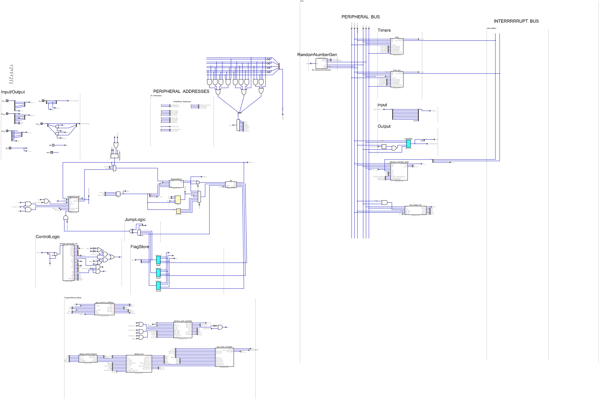

# Remedy CPU / TinyCPU Datasheet

## How to test

Use the custom IDE/toolchain to assemble TinyCPU assembly, or the work-in-progress cpp-ish compiler, then upload the generated program image to the external flash. I am also working on a vscode extension to integrate these steps into a more user-friendly workflow. with code upload, flash programming, and serial debugging features hopefully. 

[Here is the Repo link](https://github.com/leonidas213/Remedy-Compiler) : https://github.com/leonidas213/Remedy-Compiler
### Assembler


### Work in progress compiler


## External hardware

The CPU uses external serial memory instead of internal program/data memory.

| Device | Mode used by current hardware | Purpose |
|---|---|---|
| SPI/QSPI Flash | QSPI continuous-read mode | Program fetch and `ldf` flash reads |
| SPI RAM / PSRAM | Plain SPI mode | Data load/store |

The CPU is a 16-bit design and only reads/writes memory in 16-bit half-words. CPU memory addresses are word addresses. Externally, the memory interface appends one zero bit to form byte addresses, so CPU address `0x0001` maps to external byte address `0x000002`.

Usable external address range:

```text
CPU word address: 0x0000-0xFFFF
External byte address used: 0x00000-0x1FFFF
Effective byte range: 128 KiB per memory device
```

Example: if flash byte memory starts with `0x3D F1 25 48`, the CPU can read `0x3DF1` at word address `0x0000` and `0x2548` at word address `0x0001`. It cannot directly read the unaligned half-word `0xF125`.

## Pin usage

| Pin group | Use |
|---|---|
| `ui_in[5:0]` | General input pins |
| `ui_in[6]` | Debug serial data input |
| `ui_in[7]` | Debug serial clock input |
| `uo_out[5:0]` | General output pins from `OutputReg[5:0]` |
| `uo_out[6]` | General output `OutputReg[6]`, or I2C SCL when I2C is active |
| `uo_out[7]` | General output `OutputReg[7]`, or debugger data output when debugger drives it |
| `uio[0]` | Flash CS |
| `uio[1]` | Flash/RAM IO0 / MOSI |
| `uio[2]` | Flash/RAM IO1 / MISO |
| `uio[3]` | Shared serial clock |
| `uio[4]` | Flash IO2 |
| `uio[5]` | Flash IO3 |
| `uio[6]` | RAM CS |
| `uio[7]` | I2C SDA |

## Memory interface

### Startup flash initialization

At reset the memory interface initializes the flash before the CPU can fetch instructions. The current startup sequence is:

```text
0x66              ; flash reset enable
0x99              ; flash reset
0x06              ; write enable
0x31 0x02         ; set status/config register 2, enable quad mode
0xEB              ; enter QSPI fast-read/continuous-read path
0x00 0x00 0x00 0xA0 0x00 0x00
                  ; address 0, mode bits A0, dummy clocks
```

RAM reset/init was removed to save area. RAM CS stays high during flash initialization.

### Runtime flash read

Flash is treated as read-only by this memory interface. Runtime flash access uses QSPI continuous read:

```text
CS low
24-bit byte address = {7'b0, cpu_addr[15:0], 1'b0}
2 QSPI mode nibbles: A, 0
4 QSPI dummy clocks
4 QSPI data clocks = 16-bit word
CS high
```

The external SPI/QSPI clock toggles every system clock, so one external serial clock period is two system clock cycles.

### Runtime RAM read/write

RAM uses normal SPI:

```text
Read command  = 0x03
Write command = 0x02
24-bit byte address = {1'b0, 6'b0, cpu_addr[15:0], 1'b0}
16-bit data word
```

Flash writes are intentionally blocked in the current memory wrapper.

# CPU specs



## Overview

- 16-bit CPU datapath
- 16 general purpose 16-bit registers
- `r13`/`BP`, `r14`/`SP`, and `r15`/`RA` are conventionally used as branch pointer, stack pointer, and return address, but they are still can be used as normal registers
- 16-bit instruction words
- Immediate words have MSB = 1 and load the immediate register instead of executing as a normal opcode
- External flash and RAM are accessed only as 16-bit half-words
- ALU flags: Negative, Zero, Carry
- Fixed interrupt vector: `0x0002`
- Debugger supports halt/run/step, one dynamic breakpoint, static `brk`, and jump/load-PC

## Immediate format

Any fetched word with bit 15 set is treated as an immediate word. It updates the immediate register and does not execute as a normal instruction. The following real instruction can then consume that immediate value.

Example concept:

```asm
; Assembly:
jump 0xF123

; Encoded as two 16-bit words:
0xF123     ; immediate word
0x3C01     ; absolute jump instruction using the immediate register/sign bit field
```

This is why the debugger can also inject multi-word commands by feeding the same 16-bit words the flash would have returned.

## Timers

There are two timers:

| Timer | Counter width | Target width | Read address |
|---|---:|---:|---:|
| Timer 1 | 16-bit | 16-bit | `timer1ReadAdr = 5` |
| Timer 2 | 9-bit | 9-bit | `timer2ReadAdr = 9` |

Timer 2 is called the tiny timer in the RTL, but it is currently 9-bit, not 8-bit.

Both timers use the same 8-bit config layout:

| Bit(s) | Name | Meaning |
|---:|---|---|
| `[0]` | enable | Enables the timer |
| `[4:1]` | prescaler | Prescaler select |
| `[5]` | auto reload | When target matches, reset count to zero instead of staying at target |
| `[6]` | IRQ enable | Timer asserts interrupt when target matches |

Prescaler encoding:

| Value | Divide |
|---:|---:|
| 0 | `/1` |
| 1 | `/2` |
| 2 | `/4` |
| 3 | `/8` |
| 4 | `/16` |
| 5 | `/32` |
| 6 | `/64` |
| 7 | `/128` |
| 8 | `/256` |
| 9 | `/512` |
| 10 | `/1024` |
| 11 | `/2048` |
| 12-15 | reserved/currently behaves like `/1` |


Examples:

| Source | Prescaler | Timer tick |
|---|---:|---:|
| System clock | `/2048` | 81.92 us |


Max overflow times with `/2048`:

| Timer | System clock source |
|---|---:|
| 16-bit timer | about 5.37 s |
| 9-bit timer | about 41.94 ms |

Notes:

- A target value of zero disables match detection because the RTL uses `target != 0` as `target_valid`.
- During interrupt lock (`InterLock`), the timer count does not advance. The prescaler can still advance when the timer is enabled.
- Writing to the timer reset address with bit 0 set clears count, clears prescaler, and clears timer config.
- Writing `timerSyncStart` updates bit 0, the enable bit, of both timer configs at the same time.

## Interrupts

The interrupt system uses one fixed interrupt vector and software dispatch:

```text
Interrupt vector = 0x0002
Return instruction = reti
```

Interrupt sources:

| Bit | Source |
|---:|---|
| 0 | Timer 1 |
| 1 | Timer 2 |
| 2 | I2C |

There is no separate per-input-pin interrupt source in the current top-level wiring.

Interrupt registers:

| Address | Name | Write behavior | Read behavior |
|---:|---|---|---|
| 13 | `CpuinterruptEnable` | bit 0 = global interrupt enable | bit 0 = global enable, bit 1 = IRQ lock, bit 2 = active interrupt request |
| 14 | `InputInterruptEnable` | bits `[2:0]` = IRQ source enable mask | current IRQ enable mask |
| 15 | `InterruptRegister` | write 1s to clear pending bits | current pending bits |

Important behavior:

- IRQ requests are latched into pending bits.
- `InterruptRegister` is write-one-to-clear.
- Interrupts are blocked while `imm` is active, so an interrupt should not break an immediate word plus the following immediate-consuming instruction.
- Once an interrupt is taken, the controller locks until `reti` is executed.
- If another source becomes pending while locked, it remains pending and can trigger after `reti` if still enabled.

A typical ISR should read `InterruptRegister`, handle each set bit, clear the handled bits by writing 1s back to `InterruptRegister`, then execute `reti`.

## I2C master

The I2C block is now a small fixed-speed master. It does not use the old programmable 16-bit prescaler anymore.

Approximate SCL rate:

```text
SCL ≈ clk / (3 * (I2C_DIV + 1))
I2C_DIV = 20
At 25 MHz: SCL ≈ 397 kHz
```

I2C register map:

| CPU address | Lower I2C reg | Name | Description |
|---:|---:|---|---|
| 16 | 0 | `I2cCtrl` | bit 0 = enable, bit 1 = IRQ enable |
| 17 | 1 | `I2cStatus` | bit 0 busy, bit 1 bus active, bit 2 done, bit 3 ack error, bit 4 rx valid, bit 5 interrupt pending/done |
| 18 | 2 | `I2cDivider` / legacy `I2cPrescaler` | read-only divider value, currently 20 |
| 19 | 3 | `I2cDataReg` | write TX byte / read RX byte |
| 20 | 4 | `I2cCommand` | command bits |

`I2cStatus` sticky bits are cleared by writing 1s:

| Status bit | Clear behavior |
|---:|---|
| 2 | write 1 to clear `done` |
| 3 | write 1 to clear `ack_error` |
| 4 | write 1 to clear `rx_valid` |

Command register bits:

| Bit | Command |
|---:|---|
| 0 | START |
| 1 | STOP |
| 2 | WRITE byte |
| 3 | READ byte |
| 4 | NACK after read |

You can combine bits, for example START+WRITE for address phase, READ+NACK+STOP for the final byte of a read transaction.

## Debugger

The debug serial frontend receives 32-bit frames using the debug clock and debug data input:

```text
8'hA5 sync + 4-bit command + 4-bit register address + 16-bit data
```

Commands:

| Command | Meaning |
|---:|---|
| 0 | Ping |
| 1 | Read debug register |
| 2 | Write debug register |

Responses are 16-bit:

| Response | Meaning |
|---:|---|
| `0xDB12` | Ping response |
| `0xACCE` | Write accepted |
| read data | Read command response |
| `0xEEEE` | Invalid/error response |

Debug registers:

| Reg | Name | Description |
|---:|---|---|
| 0 | ID | reads `0xDB11` |
| 1 | STATUS | bit 0 halt request, bit 1 jump pending, bit 3 halted, bit 4 debug enable, bit 5 static break enable, bit 6 breakpoint enable, bit 7 resume mask |
| 2 | CONTROL | bit 0 debug enable, bit 1 halt request, bit 2 run pulse, bit 3 step pulse, bit 5 static break enable, bit 6 jump/load-PC request |
| 3 | FLAGS | bit 0 Negative, bit 1 Zero, bit 2 Carry |
| 4 | PC | current program counter |
| 5 | IR | current instruction register |
| 6 | BP0 | dynamic breakpoint address |
| 7 | BPCTRL | bit 0 enables BP0 |
| 8 | JUMP_ADDR | address used by CONTROL bit 6 |

Only one dynamic breakpoint is currently implemented. The static breakpoint instruction is opcode `0x49` / `brk`; it only halts when static break is enabled.

## Register map

```text
InputReg               = 0    ; 16-bit read, lower 8 bits contain input pins/debug pins
OutputReg              = 1    ; 8-bit output register

timer1Config           = 2    ; 8-bit timer config
timer1Target           = 3    ; 16-bit target
timer1Reset            = 4    ; write bit 0 = reset timer1
timer1ReadAdr          = 5    ; read 16-bit timer1 count

timer2Config           = 6    ; 8-bit timer config
timer2Target           = 7    ; 9-bit target
timer2Reset            = 8    ; write bit 0 = reset timer2
timer2ReadAdr          = 9    ; read 9-bit timer2 count, zero-extended

timerSyncStart         = 10   ; write bit 0 to update enable bit of both timers

RandomSeedAddr         = 11   ; write 8-bit RNG seed
RandomReg              = 12   ; read generated random value

CpuinterruptEnable     = 13   ; global interrupt control/status
InputInterruptEnable   = 14   ; IRQ source enable mask, legacy name
InterruptRegister      = 15   ; IRQ pending register, write-one-to-clear

I2cCtrl                = 16
I2cStatus              = 17
I2cDivider             = 18   ; fixed divider readback, legacy name I2cPrescaler
I2cDataReg             = 19
I2cCommand             = 20
```

## Programming examples

### Basic addition and store

```asm
ldi r1, 0x12
ldi r2, 0x20
add r1, r2
st 0x1000, r1
putoutput r1
```

### Timer 1, system-clock source, `/2048`, IRQ enabled, auto reload enabled

Config value:

```text
irq=1, reload=1, prescaler=11, enable=1
config = (1<<6) | (1<<5) | (11<<1) | 1 = 0x77
```

```asm
ldi r1, 0x77
out timer1Config, r1
ldi r1, 1000
out timer1Target, r1
```

### Timer 2, `/2048`, IRQ enabled, auto reload enabled

Config value:

```text
irq=1, reload=1, prescaler=11, enable=1
config = (1<<6) | (1<<5) | (11<<1) | 1 = 0xF7
```

```asm
ldi r1, 0xF7
out timer2Config, r1
ldi r1, 511
out timer2Target, r1
```

### Interrupt handler skeleton

```asm
jump main
nop
interrupt_handler: ;at memory address 0x0002
    in r0, InterruptRegister

    ; timer1 pending?
    mov r1, r0
    and r1, 1
    jumpZero check_timer2
    ; handle timer1 here
    ldi r1, 1
    out InterruptRegister, r1

check_timer2:
    mov r1, r0
    and r1, 2
    jumpZero check_i2c
    ; handle timer2 here
    ldi r1, 2
    out InterruptRegister, r1

check_i2c:
    mov r1, r0
    and r1, 4
    jumpZero irq_done
    ; handle i2c here
    ldi r1, 4
    out InterruptRegister, r1

irq_done:
    reti

main:
    ; main program here
    jump main
```

# Opcode Table

| Opcode | Instruction | Description |
|---|---|---|
| `0x00` | `nop` | Does nothing. |
| `0x01` | `mov rd, rs` | Move the content of Rs to register Rd |
| `0x02` | `add rd, rs` | Adds the content of register Rs to register Rd without carry. |
| `0x03` | `adc rd, rs` | Adds the content of register Rs to register Rd with carry. |
| `0x04` | `sub rd, rs` | Subtracts the content of register Rs from register Rd without carry. |
| `0x05` | `sbc rd, rs` | Subtracts the content of register Rs from register Rd with carry. |
| `0x06` | `and rd, rs` | Performs a bitwise AND between Rd and Rs, and stores the result in Rd. |
| `0x07` | `or rd, rs` | Performs a bitwise OR between Rd and Rs, and stores the result in Rd. |
| `0x08` | `xor rd, rs` | Performs a bitwise XOR between Rd and Rs, and stores the result in Rd. |
| `0x09` | `ldi rd, i16` | Loads Register Rd with the constant value [value]. |
| `0x0A` | `ldi rd, u4` | Loads Register Rd with the constant value [value]. |
| `0x0B` | `add rd, i16` | Adds an immediate constant [value] to register Rd without carry. |
| `0x0C` | `add rd, u4` | Adds an immediate constant [value] to register Rd without carry. |
| `0x0D` | `adc rd, i16` | Adds an immediate constant [value] to register Rd with carry. |
| `0x0E` | `adc rd, u4` | Adds an immediate constant [value] to register Rd with carry. |
| `0x0F` | `sub rd, i16` | Subtracts an immediate constant [value] from register Rd without carry. |
| `0x10` | `sub rd, u4` | Subtracts an immediate constant [value] from register Rd without carry. |
| `0x11` | `sbc rd, i16` | Subtracts an immediate constant [value] from register Rd with carry. |
| `0x12` | `sbc rd, u4` | Subtracts an immediate constant [value] from register Rd with carry. |
| `0x13` | `neg rd` | Stores the two's complement of Rd in register Rd. |
| `0x14` | `and rd, i16` | Performs a bitwise AND between Rd and an immediate constant [value], and stores the result in Rd. |
| `0x15` | `and rd, u4` | Performs a bitwise AND between Rd and an immediate constant [value], and stores the result in Rd. |
| `0x16` | `or rd, i16` | Performs a bitwise OR between Rd and an immediate constant [value], and stores the result in Rd. |
| `0x17` | `or rd, u4` | Performs a bitwise OR between Rd and an immediate constant [value], and stores the result in Rd. |
| `0x18` | `xor rd, i16` | Performs a bitwise XOR between Rd and an immediate constant [value], and stores the result in Rd. |
| `0x19` | `xor rd, u4` | Performs a bitwise XOR between Rd and an immediate constant [value], and stores the result in Rd. |
| `0x1A` | `not rd` | Stores not Rd in register Rd. |
| `0x1B` | `reserved` ||
| `0x1C` | `reserved` ||
| `0x1D` | `reserved` ||
| `0x1E` | `cmp rd, rs` | Compares Rd, and Rs (subtracts Rs from Rd without storing the result) Without using carry flag. Flags are updated accordingly. |
| `0x1F` | `cpc rd, rs` | Compares Rd, and Rs  (subtracts Rs from Rd without storing the result) With carry flag. Flags are updated accordingly. |
| `0x20` | `cmp rd, i16` | Compares Rd, and an immediate constant [value] (subtracts Rs from Rd without storing the result) Without using carry flag. Flags are updated accordingly. |
| `0x21` | `cmp rd, u4` | Compares Rd, and an immediate constant [value] (subtracts Rs from Rd without storing the result) Without using carry flag. Flags are updated accordingly. |
| `0x22` | `cpc rd, i16` | Compares Rd, and an immediate constant [value] (subtracts Rs from Rd without storing the result) With carry flag. Flags are updated accordingly. |
| `0x23` | `cpc rd, u4` | Compares Rd, and an immediate constant [value] (subtracts Rs from Rd without storing the result) With carry flag. Flags are updated accordingly. |
| `0x24` | `lsl rd` | Shifts register Rd by one bit to the left. A zero bit is filled in and the highest bit is moved to the carry bit. |
| `0x25` | `lsr rd` | Shifts register Rd by one bit to the right. A zero bit is filled in and the lowest bit is moved to the carry bit. |
| `0x26` | `rol rd` | Shifts register Rd by one bit to the left. The carry bit is filled in and the highest bit is moved to the carry bit. |
| `0x27` | `ror rd` | Shifts register Rd by one bit to the right. The carry bit is filled in and the lowest bit is moved to the carry bit. |
| `0x28` | `asr rd` | Shifts register Rd by one bit to the right. The MSB remains unchanged and the lowest bit is moved to the carry bit. |
| `0x29` | `swap rd` | Swaps the high and low byte in register Rd. |
| `0x2A` | `swapn rd` | Swaps the high and low nibbles of both bytes in register Rd. |
| `0x2B` | `st [rd], rs` | Stores the content of register Rs to the memory at the address [Rd] from Ram. |
| `0x2C` | `ld rd, [rs]` | Loads the value at memory address [Rs] to register Rd from Ram. |
| `0x2D` | `st i16, rd` | Stores the content of register Rs to memory at the location given by [const] from Ram. |
| `0x2E` | `st u4, rd` | Stores the content of register Rs to memory at the location given by [const] from Ram. |
| `0x2F` | `ld rd, i16` | Loads the memory value at the location given by [const] to register Rd from Ram. |
| `0x30` | `ld rd, u4` | Loads the memory value at the location given by [const] to register Rd from Ram. |
| `0x31` | `st [rd +- value], rs` | Stores the content of register Rs to the memory at the address (Rd+[const]) from Ram. |
| `0x32` | `ld rd, [rs +- value]` | Loads the value at memory address (Rs+[const]) to register Rd from Ram. |
| `0x33` | `Reserved` | |
| `0x34` | `jumpCarry i8` | Jump if Carry flag is set. (Relative, max jump +-128).  |
| `0x35` | `jumpZero i8` | Jump if Zero flag is set. (Relative, max jump +-128).    |
| `0x36` | `jumpNegative i8` |  Jump if Negative flag is set. (Relative, max jump +-128).   |
| `0x37` | `jumpNotCarry i8` | Jump if Carry flag is not set. Relative jump. |
| `0x38` | `jumpNotZero i8` | Jump if Zero flag is not set. Relative jump. |
| `0x39` | `jumpNotNegative i8` | Jump if Negative flag is not set. Relative jump. |
| `0x3A` | `rcall rd, i16` |  store current value to the Rd register and jump to immediate value. |
| `0x3B` | `rret rs` | Return/jump to the address stored in register Rs. |
| `0x3C` | `jump i16` | absolute Jump to memory address. |
| `0x3D` | `jump i8` | Relative jump using signed offset. Assembler chooses this when possible. |
| `0x3E` | `out i16, rs` | writes Rd register value to the immediate address.  |
| `0x3F` | `out u4, rs` |  writes Rd register value to the immediate address. |
| `0x40` | `outr [rd], rs` |  writes Rd value to the adress in the Rs register. |
| `0x41` | `in rd, i16` | Reads the value at immediate address into Rd.  |
| `0x42` | `in rd, u4` |  Reads the value at immediate address into Rd. |
| `0x43` | `inr rd, [rs]` | Reads the value at Rs value address into Rd.  |
| `0x44` | `reti` | Only used in interrupt function. it will return to the address when the interrupt happened.  |
| `0x45` | `ldf rd, [rs]` | Reads the value at Rs value address into Rd from flash memory.  |
| `0x46` | `ldf rd, i16` | Reads the immediate address into Rd from flash memory.  |
| `0x47` | `ldf rd, u4` | Reads the immediate address into Rd from flash memory.  |
| `0x48` | `ldf rd, [rs +- value]` | Loads the value at memory address (Rs+-[const]) to register Rd from flash memory.  |
| `0x49` | `brk` | Static breakpoint instruction. Only halts when debugger static break is enabled. |

