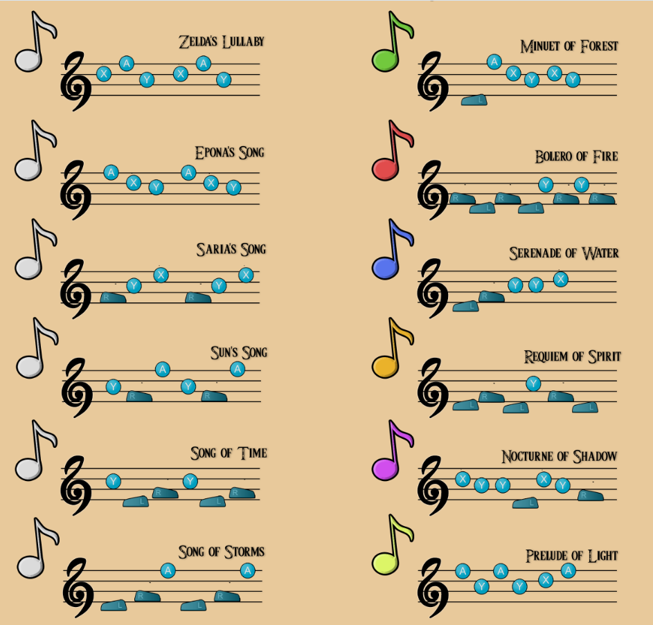

# Tiny Ocarina VGA Song 

This project is a small VGA/audio ocarina interface made for a TinyTapeout for The Legend of Zelda: Majora's Mask 3D on Nintendo 3DS. It draws a simple rectangle-based ocarina (yep its not pixel art, I manually drew it, by hand, with topleft corner to bottomright corner), plays square-wave notes, and shows a lightweight song sheet on a music staff.
## External hardware

- VGA Pmod
- Audio Pmod
- Gamepad Pmod and gamepad

## Main Features

- Five main playable buttons: `A`, `X`, `Y`, `L`, `R` ( we don't like `B` >:( )
- D-pad pitch modifier
- 3 built-in song sheets
- 6-note history display

## Controls

| Button | Action |
|---|---|
| `A` | Play high D row note |
| `X` | Play B row note |
| `Y` | Play A row note |
| `L` | Play low D row note |
| `R` | Play F row note |
| D-pad | Modify played pitch only |
| `Start` | Cycle selected song helper |
| `Select` | Clear note history |

The D-pad changes onlt the audio pitch. The staff location is based only on the main button: `A`, `X`, `Y`, `L`, or `R`.

## Base Note Mapping

| Button | Base pitch | Staff position |
|---|---|---|
| `A` | D5 | Highest row |
| `X` | B4 | Second row |
| `Y` | A4 | Middle row |
| `R` | F4 | Lower row |
| `L` | D4 | Lowest row |

## D-Pad Pitch Modifiers

The D-pad creates extra pitches while keeping the same visual row.
I found this online hopefully they are faithfull to
the game. sAlso Hopefully I assigned correct frequencies.

| Main button | D-pad modifier | Played pitch |
|---|---|---|
| `A` | none | D5 |
| `A` | Down | C#5 |
| `A` | Up | D#5 |
| `Y` | none | A4 |
| `Y` | Down | G#4 |
| `Y` | Up | A#4 |
| `X` | none | B4 |
| `X` | Up | C5 |
| `L` | none | D4 |
| `L` | Down | C#4 |
| `L` | Up | D#4 |
| `R` | none | F4 |
| `R` | Down | E4 |
| `R` | Up | F#4 |

## Song Helper

The song helper shows the selected 6-note pattern on the staff. It does not check whether the player is correct. It only displays the target notes and the recent note history.

`Start` cycles through the three available songs.

| Slot | Song | Sequence |
|---:|---|---|
| 0 | Zelda's Lullaby | `X A Y X A Y` |
| 1 | Song of Time | `Y L R Y L R` |
| 2 | Epona's Song | `A X Y A X Y` |
| 3 | Empty | `Play what YOU want` |

Or you can play your own songs.

