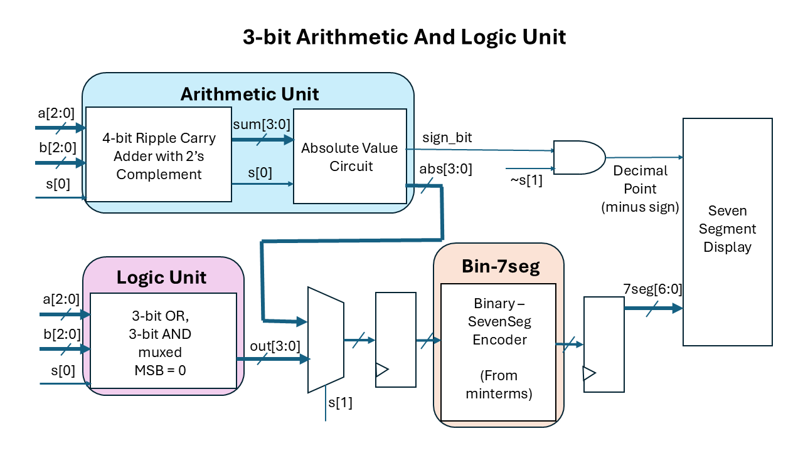
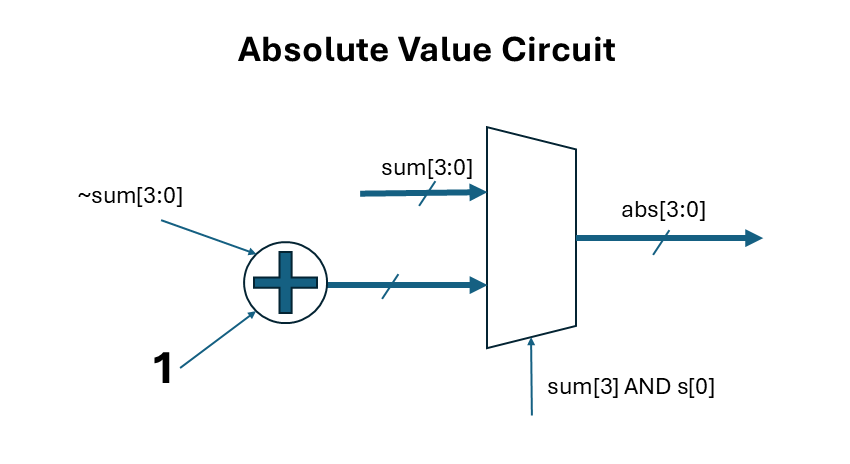

# 3-Bit ALU

## 1.  Overview

This circuit implements a **3-Bit Arithmetic Logic Unit (ALU)** capable of performing arithmetic and logical operations on two 3-bit binary numbers.  

The ALU supports:

- Addition
- Subtraction
- Bitwise OR
- Bitwise AND

The result is displayed on a **7-segment display in hexadecimal**.

###  Inputs and Outputs

The input pins are configured as follows:

| Pin | Signal | Description |
|-----|--------|-------------|
| IN0 | `a[2]` | MSB of input `a` |
| IN1 | `a[1]` | Middle bit of input `a` |
| IN2 | `a[0]` | LSB of input `a` |
| IN3 | `b[2]` | MSB of input `b` |
| IN4 | `b[1]` | Middle bit of input `b` |
| IN5 | `b[0]` | LSB of input `b` |
| IN6 | `s[1]` | MSB of select input `s` |
| IN7 | `s[0]` | LSB of select input `s` |

Where:

- `a[2:0]` and `b[2:0]` are the two 3-bit binary operands.
- `s[1:0]` is the select input used to choose the ALU operation.

### Output Display

The ALU output is displayed on a 7-segment display in hexadecimal.

For subtraction operations that produce a negative result:

- The decimal point (`DP`) on the 7-segment display is used as a **negative sign indicator**
- `DP = 1` indicates the displayed value is negative
- `DP = 0` indicates the displayed value is positive

Example:

```text
a = 001₂ (1)
b = 011₂ (3)
s = 01 (subtract)

1 - 3 = -2
```

The display will show 2 with the decimal point illuminated to indicate the result is `-2`


---

## 2. ALU Operations

The select line can be configured to perform the following operations - 

| Select Value | Operation |
|--------------|-----------|
| `00` | `a[2:0] + b[2:0]` |
| `01` | `a[2:0] - b[2:0]` |
| `10` | `a[2:0] OR b[2:0]` |
| `11` | `a[2:0] AND b[2:0]` |

s[1] essentially selects the type of operation

- `s[1] = 0` → Arithmetic operations
- `s[1] = 1` → Logic operations

---

## 3. Architecture

The ALU is divided into two main sections:

1. **Arithmetic Unit**
   - Performs addition and subtraction
   - Implemented using a ripple-carry adder
   - Subtraction is achieved using **2’s complement arithmetic**

2. **Logic Unit**
   - Performs bitwise AND and OR operations

A multiplexer selects the appropriate output based on the select input `s[1:0]`.

The following is a system diagram of the ALU - 



## 4. Arithmetic Operation

### 4.1 Arithmetic Unit Interface

The arithmetic unit takes the operands and select lines as inputs and produces both a 4-bit absolute value and a sign indicator for display purposes.

### Inputs and Outputs

| Signal | Direction | Description |
|--------|----------|-------------|
| `a[2:0]` | Input | First 3-bit operand |
| `b[2:0]` | Input | Second 3-bit operand |
| `s[0]` | Input | Operation select line (addition/subtraction control) |
| `abs[3:0]` | Output | 4-bit absolute value of the arithmetic result |
| `sign_bit` | Output | Indicate sign of result from arithmetic (used to drive 7-segment DP) |

## 4.2 Arithmetic Unit Design

The arithmetic section of the ALU is implemented using a **4-bit ripple carry adder** with additional logic to support **2’s complement arithmetic**. This stage is followed by an absolute value circuit. 


### 4.2.1 Ripple Carry Adder Structure

The arithmetic unit uses a **4-bit ripple carry adder** composed of:

- Three full-adder stages
- One final half-adder stage (without the carry out)

#### Stage Breakdown

| Stage | Type | Purpose |
|---|---|---|
| Bit 0 | Full Adder | LSB computation |
| Bit 1 | Full Adder | Intermediate computation |
| Bit 2 | Full Adder | MSB of 3-bit operands |
| Bit 3 | Half Adder / XOR Stage | Sign or overflow extension |

The final stage does not propagate a carry-out and is implemented using only an XOR operation. It represents the negative sign for 2's complement, or an overflow in addition.

The subtraction option produces a range of outputs [-7, 7], thus never using the 4th bit. This limited range occurs because this particular ALU doesn't support 2 negative numbers; the first operand 'a' can only be a positive value. Hence this 4th bit is used as the sign bit in 2's complement format, which is later useful in evaluating the absolute value.

However, the addition option produces a range of outputs [0, 14] which overflows into the 4th bit. 

Hence MSB = 1 strictly means either 
- an overflow in addition or 
- a sign bit in subtraction. 

Determining whether the MSB = 1 is due to overflow or is sign bit is based on the value of s[0]:  whether the user's intent was subtraction or addition.

### 4.2.2 2's Complement Arithmetic Implementation

2’s Complement allows the same binary adder circuit to perform both addition and subtraction by representing negative numbers in 2’s complement form.

In a 2’s complement number:
- The most significant bit (MSB) acts as the sign bit
  - `0` indicates a positive number
  - `1` indicates a negative number
- Positive numbers are represented normally (unchanged binary form)
- Negative numbers are represented using the 2’s complement method

To convert a binary number into its 2’s complement representation:
1. Invert all the bits (change `0`s to `1`s and `1`s to `0`s)
2. Add `1` to the result

This approach simplifies digital circuit design because subtraction can be performed using the same hardware as addition.

#### Flipping the bits

The operand `b[2:0]` and not (`b[2:0]`) are passed through a bank of multiplexers controlled by the select line `s[0]`.

The behavior is:

| `s[0]` | Operation | Value Passed to Adder |
|---|---|---|
| `0` | Addition | `b` |
| `1` | Subtraction | `~b` |

Therefore:

- During addition, the adder receives `b`
- During subtraction, all bits of `b` are inverted before entering the adder

This implements the first step of 2’s complement subtraction.


#### Carry-In Control

The select line `s[0]` is also connected to the carry-in of the ripple carry adder.

Therefore:

| `s[0]` | Carry-In |
|---|---|
| `0` | `0` |
| `1` | `1` |

Additionally, the MSB (4th bit) is set as s[0] XOR carry_in, indicating a negative sign.

So when subtraction is selected:

1. The bits of `b` are inverted
2. A `1` is added through the carry-in input
3. The MSB is set to 1

### 4.2.3 Absolute Value Circuit

To convert the 2's complement representation into absolute value, we first evaluate whether the value from the adder is a negative or positive value.
- The condition where MSB = 1 and subtraction was user intent (s[0]=1; s[1] is common) => negative number. In this case, we need to perform 2’s complement operation of flipping the bits and adding one to get absolute value. 
- In other cases, the output from the adder is a positive number, which doesn't need to be further operated upon. 

A cascade of half adders is used to add 1 to the inverted bits.

Below is the circuit diagram for the Absolute Value Circuit.



---

 ##  5. Binary to 7 Segment Encoder

 The following was the truthe table from binary to displaying it's equivalent hex value in the seven segment display.

 | Binary | Hex | ABCDEFG (7SEG) |
|--------|-----|----------------|
| 0000 | 0 | 1111110 |
| 0001 | 1 | 0110000 |
| 0010 | 2 | 1101101 |
| 0011 | 3 | 1111001 |
| 0100 | 4 | 0110011 |
| 0101 | 5 | 1011011 |
| 0110 | 6 | 1011111 |
| 0111 | 7 | 1110000 |
| 1000 | 8 | 1111111 |
| 1001 | 9 | 1111011 |
| 1010 | A | 1110111 |
| 1011 | B | 0011111 |
| 1100 | C | 1011110 |
| 1101 | D | 0111101 |
| 1110 | E | 1001111 |

F is not included as it is an unreachable value.

The binary expression for each segment of the display is reduced using karnaugh map and is implemented as a sum-of-products (minterms) in the ALU.

## How to test

User can test by setting values of operands a[2:0], b[2:0] and selecting the desired operation using the select lines s[1:0].
The circuit starts in an unknown state, so the seven segment display dispalys a random sequence on startup.
It takes 2 clock cycles/ button presses for triggering clock for the input to propagate through to the output.

###  Example

If:

```text
a = 101₂ (5)
b = 111₂ (7)
```

Then:

| Select | Operation | Result (Binary) | Result (Hex) |
|--------|-----------|-----------------|--------------|
| `00` | `5 + 7` | `1100₂` | `C₁₆` |
| `01` | `5 - 7` | `1110₂` | `2₁₆` and Decimal Point (indicating negative sign)|
| `10` | `101 OR 111` | `111₂` | `7₁₆` |
| `11` | `101 AND 111` | `101₂` | `5₁₆` |

After setting the input switches, trigger the clock twice to see the results on the seven segment display.

---


## External hardware

Seven Segment Display
